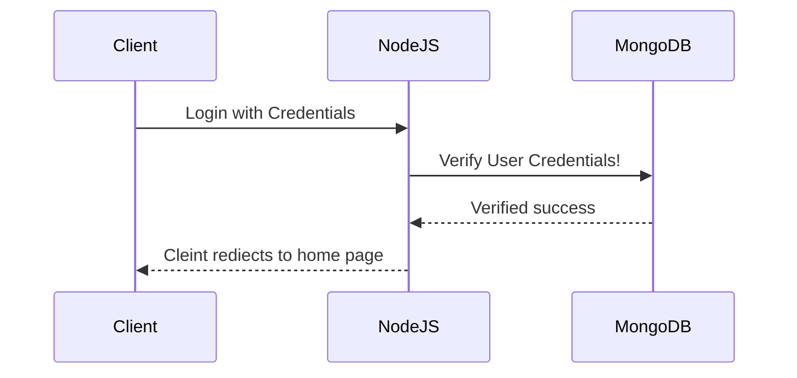
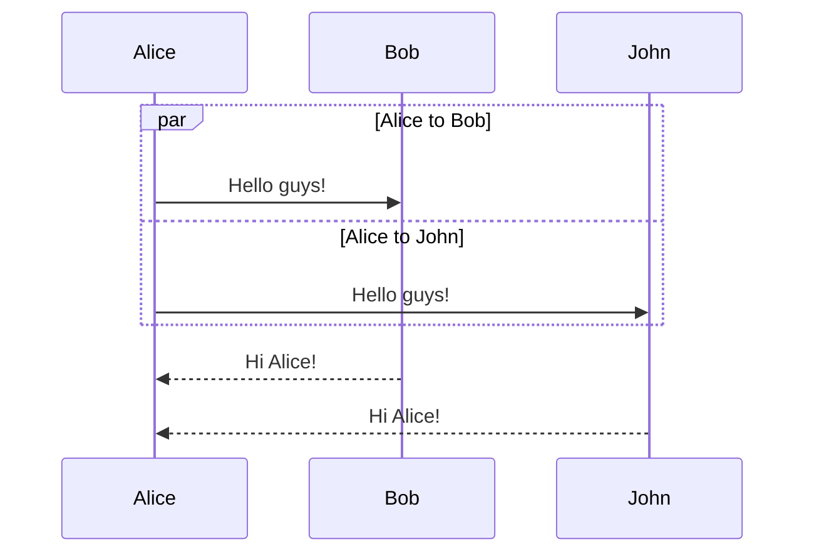

<html>
<head>
<meta charset="UTF-8">
</head>
<body>

&#128512;

</body>
</html>
:
Trying to solve conflict

Try to make a conflict  
Slove the problem  
Dealing with conflicts  
Let's have a break  
Lets take cola!  
lets solve this problem  
helooooooo  
We want to have a conflict  
New line by Hanna  

