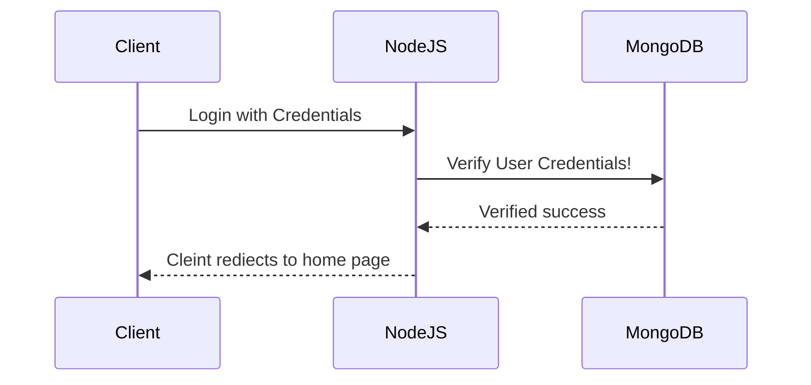
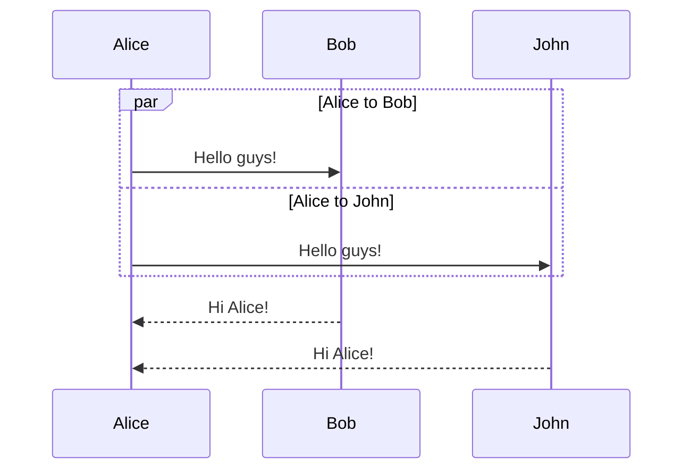

## lorem-crasher

Create React App

```bash
 npx create-react-app lorem-crasher
```

```bash
cd my-app
```

Start the server

```bash
  npm run start
```

## Install the Heroku CLI
```bash
npm install -g heroku
  ```
 ## Deploy application to Heroku
```bash
  git add .
  ```
  ```bash
git commit -m "Added a Procfile."
```
```bash
heroku login
```
```bash
heroku create
```
```bash
git push heroku main

```

```mermaid
sequenceDiagram
    participant User
    participant Registration Form
    participant  Backend server
    participant Databasae

        

   User ->>Registration Form: User details(name,email...)  
   Registration Form->>Backend server: User Submit data with user deatils
   Backend server->>Databasae: verify and save data
   Databasae-->>Backend server: Sucess and faliure massage
   Backend server-->>User: Redirect to Thank you or Failure message 
   
   ```

```mermaid
sequenceDiagram
    Alice->>John: Hello John, how are you?
    activate John
    John-->>Alice: Great!
    deactivate John

```



<html>
<head>
<meta charset="UTF-8">
</head>
<body>

<p>&#128512;</p>

</body>
</html>

 

