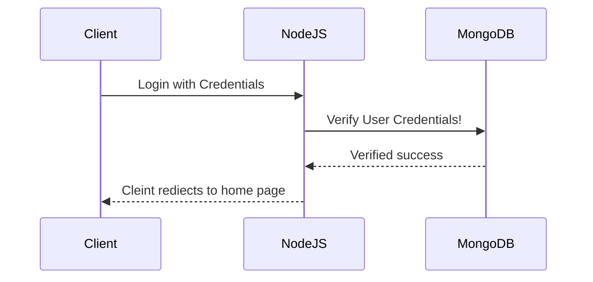
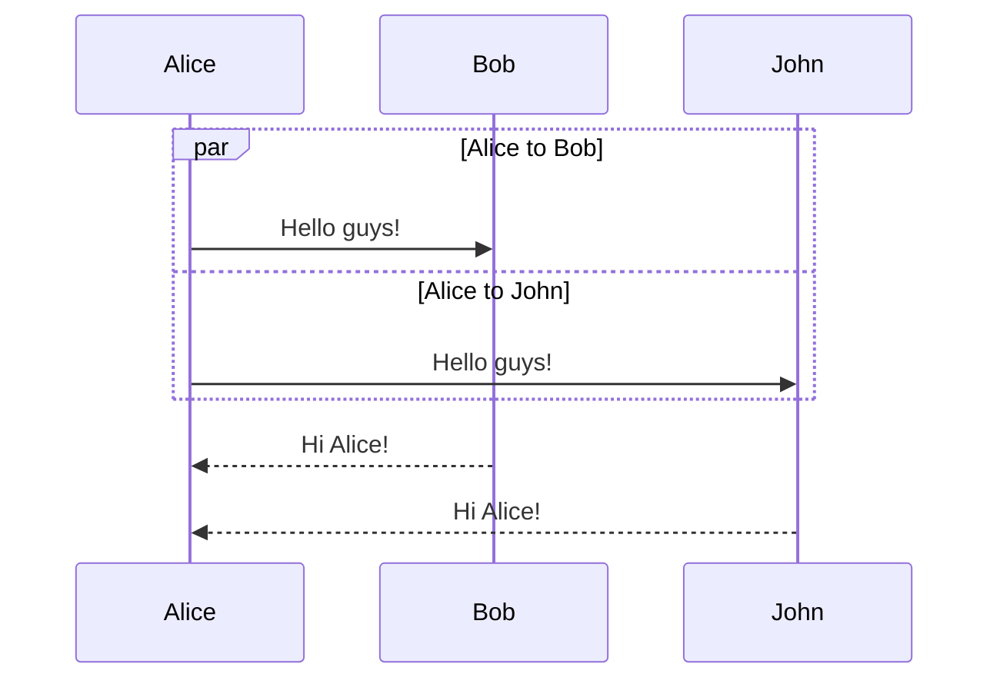

```mermaid
AVA is a test runner for Node. js. It allows you to run your JavaScript tests concurrently ( at the same time ). it can boast a simple syntax , promise and async functions , and assertion messages ,
AVA can remove unrelated lines and finds error source faster , and it will highlit the diffrences and the missing characters
it will automatically detect you CI environment  to see if it will support paralel builds ( continoues integration for developing of merging all developer code into one shared repository )

Each build will run a subset of all test files, while still making sure all tests get executed.


```


```mermaid
sequenceDiagram
    participant User
    participant Registration Form
    participant  Backend server
    participant Databasae

        

   User ->>Registration Form: User details(name,email...)  
   Registration Form->>Backend server: User Submit data with user deatils
   Backend server->>Databasae: verify and save data
   Databasae-->>Backend server: Sucess and faliure massage
   Backend server-->>User: Redirect to Thank you or Failure message 
   
   ```

```mermaid
sequenceDiagram
    Alice->>John: Hello John, how are you?
    activate John
    John-->>Alice: Great!
    deactivate John

```



<html>
<head>
<meta charset="UTF-8">
</head>
<body>

<p>&#128512;</p>

</body>
</html>

 

